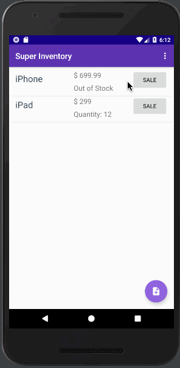

# Inventory App
> This is an Inventory App that will allow a store to keep track of its inventory of products.

> Let you know if nothing's here.
> Test this app out by generating dummy inventory

> Add inventory by using the add icon on the bottom

> Sold something? Congradurations!
> Sold something that's out of stock? No Way!

> Add more stock by clicking or inputing

> Want to order more? No problem, one calls away!

> Don't carry this product anymore? just delete it.

> Going out of business? Delete them all!

> We will let you know if you missing something.

## Getting Started

* You can *[clone](https://github.com/arrickx/superinventory.git)* or *[download](https://github.com/arrickx/superinventory.git)* this project via [GitHub](https://github.com) to your local machine.
* Download and Install *[Android Studio](https://developer.android.com/studio/index.html)*

### How to use

* Open existing Android Studio Project
* Use Android Studio emulators to run this app
* (Or use your Android phone to run this app via Android Studio)

## License

* This project is licensed under the MIT License - see the [LICENSE](LICENSE) file for details.

## Acknowledgments

* **Empty Inventory Icon** was provided by [TwoTwo](https://dribbble.com/shots/2246883-Collection-list-is-empty).

